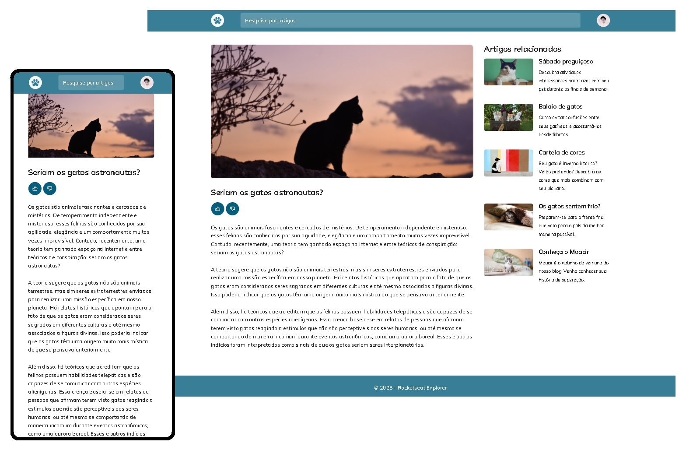

# Blog de gatos

  

Site responsivo de blog com artigos sobre gatos. O projeto também apresenta uma barra de busca, recomendação de artigos relacionados e avaliação do artigo.
- Mobile First;
- Unidades de medidas flexíveis;
- Display Grid;
- Variáveis no CSS;
- Animações e transições simples

## 🔗 Links

[Deploy](https://joaojpdev.github.io/blogcats//)
